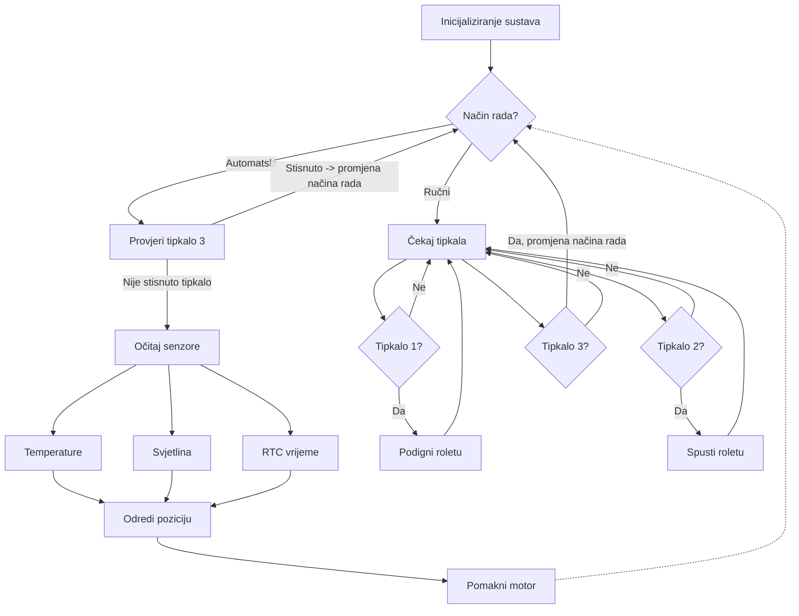

# RUS--Sustav-energetski-ucinkovitog-upravljanja-roletama
## Opis sustava
Sustav razvijen na Arduino MEGA platformi omogućuje inteligentnu regulaciju roleta temeljenu na stvarnim okolišnim uvjetima: 
 - Intenzitetu dnevnog svjetla (mjerenu putem LDR senzora)  
 - Temperaturi prostorije (DHT22 senzor)  
 - Vremenu dana (RTC modul)  
 
Upotrebom se automatizira upravljanje roletama na temelju trenutnih uvjeta okoline  i korisničkih preferencija, s ciljem:  
 ✔ Optimizacije potrošnje energije (smanjenje troškova grijanja/hlađenja)  
 ✔ Povećanja udobnosti (kontrola prirodnog svjetla i topline) 
 ✔ Pametne integracije s kućnom automatizacijom 

## Cilj projekta
Cilj je razviti automatizirani, energetski efikasan sustav za upravljanje roletama koji: 
 ✔ Smanjuje potrošnju energije kroz optimalnu kontrolu prirodnog svjetla i topline 
 ✔ Integrira senzorske podatke (svjetlina, temperatura, vrijeme) za autonomno upravljanje 
 ✔ Omogućuje ručnu nadogradnju putem tipki 
 ✔ Povećava udobnost u stambenim i poslovnim prostorima 

##  Potencijalna korist projekta
- Energetske uštede (smanjenje troškova grijanja/hlađenja)  
- Pametna integracija u kućne/uredske sustave  
- Ekološki doprinos smanjenjem ugljičnog otiska  

##  Postojeća slična rješenja
Na tržištu postoje:  
 - Timerom upravljani sustavi (fiksno vrijeme podizanja/spuštanja)  
 - Ručni daljinski upravljači (bez adaptacije na okolinu)  
 - Skupi pametni sustavi (npr. Somfy, Lutron)  
 
 Prednost našeg rješenja:   
  ✔ Jeftinija implementacija (Arduino + osnovni senzori)  
  ✔ Pametnija regulacija (trenutni uvjeti > unaprijed programirano vrijeme)  
  ✔ Open-source pristup (mogućnost prilagodbe)  

##  Skup korisnika
  - Kućanstva – za smanjenje računa za energiju   
  - Poslovni prostori – uredi, škole, bolnice   
  - Gradnja pametnih zgrada – integriranje u sustave pametnih gradova   

##  Mogućnost prilagodbe rješenja
Sustav se može nadograditi:   
  - WiFi/Bluetooth modulom za daljinsko upravljanje preko mobilne aplikacije   
  - Solarnim panelima za autonomno napajanje   
  - Integracijom s Home Assistantom ili drugim pametnim kućnim sustavima   
  - Dodatkom vremenske prognoze (API) za anticipacijsko upravljanje   

## Opseg projektnog zadatka
Uključuje:

Hardversku implementaciju:
 - Arduino MEGA
 - LDR senzor svjetline
 - DHT22 senzor temperature
 - RTC sat (DS1307)
 - Servo motor za pokretanje roleta
 - Tipke za ručno upravljanje

Softverski razvoj:
 - Algoritam za donošenje odluka (svjetlina + temperatura + vrijeme)
 - Upravljanje servo motorom
 - Serijska komunikacija za debugiranje

Testiranje:
 - Reakcija na promjene svjetline/temperature
 - Provjera rada u ručnom i automatskom načinu
 - Analiza uštede energije

## Dijagram aktivnosti rada sustava (UML)

  

## Shema

## Dokumentirani kod
